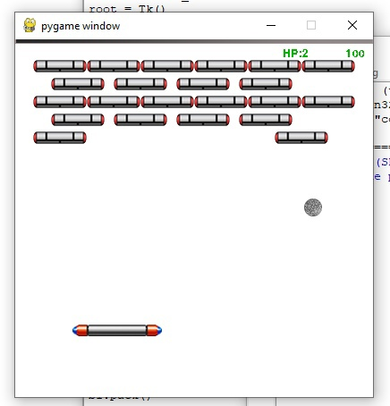
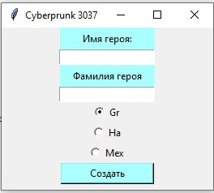
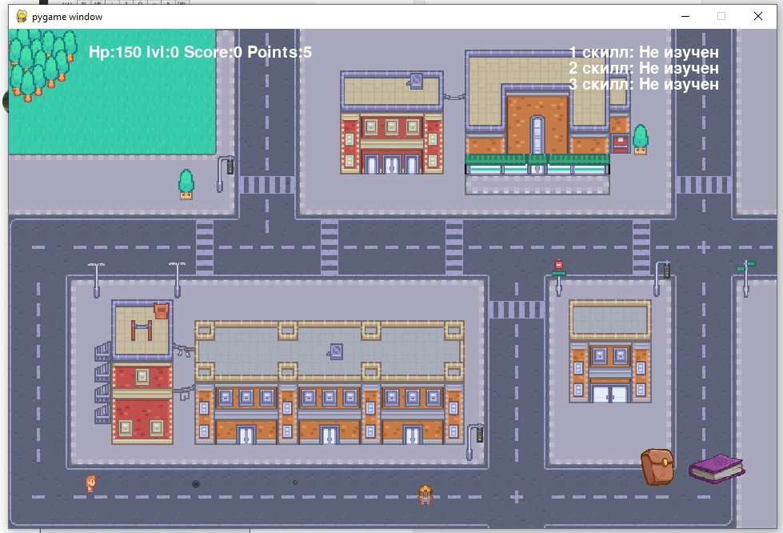
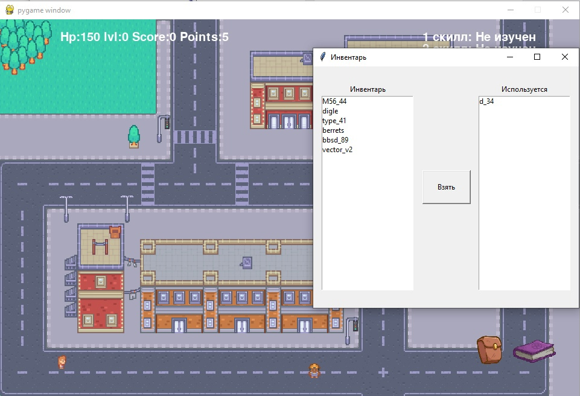
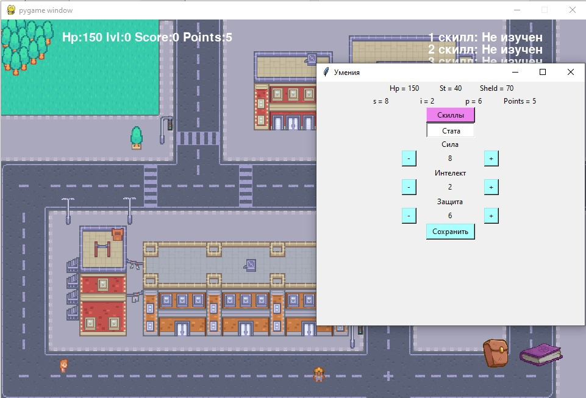

# Портфолио
## Кулаков Кирилл Вячеславович
### Образование

- Сибирский Государственный Университет Телекоммуникаций и Информатики ([СибГУТИ][df1]) на данный момент 2 курс 
- Курсы в Новосибирской академии дизайна и программирования([НАДИП][df2]) 3 года + дипломная работа
- Средняя общеобразовательная школа № 8

## навыки в области программирования\IT

- Python
    - Pygame
    - Tkinter
    - Парсинг на beautifulsoup/selenium
- С

## Участие в проектах
##### 1 Игра Арканоид на python.


В игре есть несколько уровней, суть игры заключаетсья в том, что бы сбить все ячейки и не уронить шарик.
##### 2 Дипломный проект НАДИП "Создание 2д игры в жанре RPG"



  
В игре представлено 3 класса, все они отличаються скилами и базовыми скилпоинтами.Суть игры в том, чтобы стрелять во врагов,побеждать их, набирать очки и прокачивать скиллы.В игре есть несколько вариантов врагов все они отличаютсья количеством хп,уроном,скорострельностью.В игре так же присутствует инвентарь, в котором можно выбирать оружие, окно, в котором прокачиваються скиллы и распределяються скиллпоинты.

##### 3 Бот на selenium(python)
```python
from selenium import webdriver
from selenium.webdriver.common.keys import Keys
from random import random, randrange, randint
import time
slova = ["Волк не тигр и лев, а тигр не волк","Тяжело смотреть в глаза которые закрыты","Запомните, а то забудете","Громко - это как тихо, только громче","неважно кто важно, а важно кто неважно","Сказанное слово не может быть сказано тем кто его не сказал ","Трудно - не значит невозможно, это значит просто что трудно","Побеждает всегда победитель, проигравший - проигрывает","Если сложно жить, значит живешь сложно","Красиво идет по жизни только тот, кто умеет ходить","Работа - не волк. Работа - это 'ворк'. 'Волк' - это ходить ","Быть добрым совсем не трудно, трудно быть трудно","Запомните, не губы красят девушек, а девушки красят губы","не ищи волка там где его нет, его там нет","Брат может быть братом только если он не брат"]
driver = webdriver.Chrome()
driver.get("https://mail.ru/")
elem = driver.find_element_by_id("mailbox:saveauth").click()
elem = driver.find_element_by_id("mailbox:login")
for i in "vlad.valsidalv123@mail.ru":
    elem.send_keys(i)
elem = driver.find_elements_by_class_name("o-control")
elem[1].click()
time.sleep(3)
elem = driver.find_element_by_id("mailbox:password")
for i in "Eto_Rofl":
    elem.send_keys(i)
elem = driver.find_elements_by_class_name("o-control")
elem[1].click()
time.sleep(5)
def write():
    ur = "https://otvet.mail.ru/question/"
    question = str(randint(220951531,220961531))
    url = ur + question
    driver.get(url)
    time.sleep(3)
    try:
        elem = driver.find_element_by_name("inputBody")
        sl = randint(0, (len(slova)-1))
        for i in slova[sl]:
            elem.send_keys(i)
        time.sleep(3)
        elem = driver.find_element_by_xpath("//a[@class='btn_3ykLdYEq btn_big_3d2WdsbE btn_primary_UsrGwKH1 btn_2gZHAr-3 btn__submit_1j49aTnK']").click()
        time.sleep(2)
    except:
        print("404")
i = 29
while i > 0:
    time.sleep(3)
    write()
    i-=1
    

``` 
  
Суть работы бота, заключаетсья в том, что он заходит в ответы маил ру, открывает рандомный вопрос и отвечает рандомной, изначально заданной, цитатой. В коде можно изменить количество вопросов на которые зайдет бот и сами цитаты, для его работы требуеться webdriver для hrome и установленная библеотека selenium(работоспособность завист от того, не изменялась ли верстка сайта).
##### 4 Парсер списка аудио у человека в "Вконтакте" на selenium(python)
```python
from bs4 import BeautifulSoup
import requests
import re
from selenium import webdriver
from selenium.webdriver.common.keys import Keys
import time
Play = []
Login = "Ваш логин"    # ЛОГИН
Pass = "Ваш парлоь"      #ПАРОЛЬ
repeat = 1
driver = webdriver.Chrome()
url = "https://vk.com/"
driver.get(url)
elem = driver.find_element_by_id("index_email")
for i in Login:
    elem.send_keys(i)
elem = driver.find_element_by_id("index_pass")
for i in Pass:
    elem.send_keys(i)
elem = driver.find_element_by_id("index_login_button").click()
time.sleep(10)
def Take_song(repeat):
    file_name = input("Введите имя файла > ")
    iid = input("Введите идентификатор  пользователя > ")
    url = "https://vk.com/" + iid
    driver.get(url)
    time.sleep(3)
    try:
        A = driver.find_element_by_id("profile_audios")
        Audio = A.find_element_by_tag_name("a").click()
    except:
        print("Аудио скрыты, или аккаунт является закрытым")
        repeat = 1
        return repeat
    time.sleep(3)
    Scroll = 0
    if repeat != 1:
        while Scroll < 10:
            driver.execute_script("window.scrollTo(0, document.body.scrollHeight);")
            time.sleep(2)
            Scroll +=1
        elem = driver.find_elements_by_class_name("audio_row__inner")
        print(len(elem))
        for i in range(len(elem)):
            Song_name = elem[i].find_element_by_tag_name("span").text
            Song_maker = elem[i].find_element_by_tag_name("a").text
            Song = '"' + Song_maker + ' - ' + Song_name + '"'+'\n'
            Play.append(Song)
        print("Готово")
        File_name = file_name + ".txt"
        Play_list = open(File_name, "w", encoding='utf-8')
        for i in Play:
            print(i)
            Play_list.write(i)
        Play_list.close()
while repeat == 1:
    Take_song(0)


``` 
Суть работы прораммы, заключаетсья в том, что бот заходит на тсраницу к выбранному человеку и парсит все его аудио(если аудио закрыты предложит выбрать другого пользователя) и записывает в текстовый файл.

   [df1]: <https://sibsutis.ru>
   [df2]: <https://nadip.ru/>
  