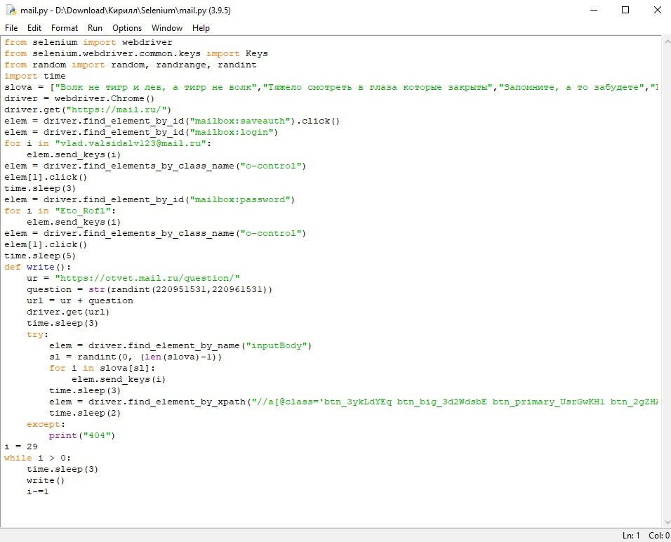
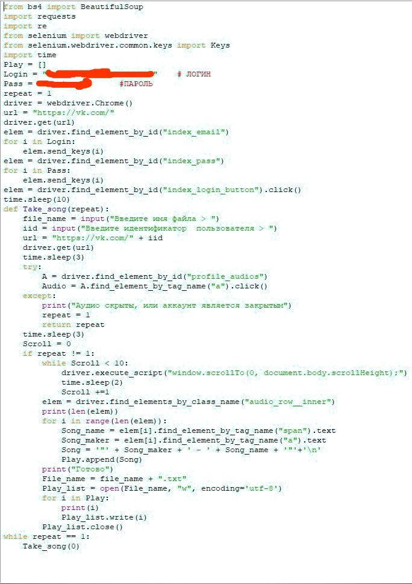

# Портфолио
## Кулаков Кирилл Вячеславович
### Образование

- Сибирский Государственный Университет Телекоммуникаций и Информатики ([СибГУТИ][df1]) на данный момент 2 курс 
- Курсы в Новосибирской академии дизайна и программирования([НАДИП][df2]) 3 года + дипломная работа
- Средняя общеобразовательная школа № 8

## навыки в области программирования\IT

- Python
    - Pygame
    - Tkinter
    - Парсинг на beautifulsoup/selenium
- С

## Участие в проектах
##### 1 Игра Арканоид на python.
  
В игре есть несколько уровней, суть игры заключаетсья в том, что бы сбить все ячейки и не уронить шарик.
##### 2 Дипломный проект НАДИП "Создание 2д игры в жанре RPG"  

  
В игре представлено 3 класса, все они отличаються скилами и базовыми скилпоинтами.Суть игры в том, чтобы стрелять во врагов,побеждать их, набирать очки и прокачивать скиллы.В игре есть несколько вариантов врагов все они отличаютсья количеством хп,уроном,скорострельностью.В игре так же присутствует инвентарь, в котором можно выбирать оружие, окно, в котором прокачиваються скиллы и распределяються скиллпоинты.
##### 3 Бот на selenium(python)
  
Суть работы бота, заключаетсья в том, что он заходит в ответы маил ру, открывает рандомный вопрос и отвечает рандомной, изначально заданной, цитатой. В коде можно изменить количество вопросов на которые зайдет бот и сами цитаты, для его работы требуеться webdriver для hrome и установленная библеотека selenium(работоспособность завист от того, не изменялась ли верстка сайта).
##### 4 Парсер списка аудио у человека в "Вконтакте" на selenium(python)
  
Суть работы прораммы, заключаетсья в том, что бот заходит на тсраницу к выбранному человеку и парсит все его аудио(если аудио закрыты предложит выбрать другого пользователя) и записывает в текстовый файл.

   [df1]: <https://sibsutis.ru>
   [df2]: <https://nadip.ru/>
  